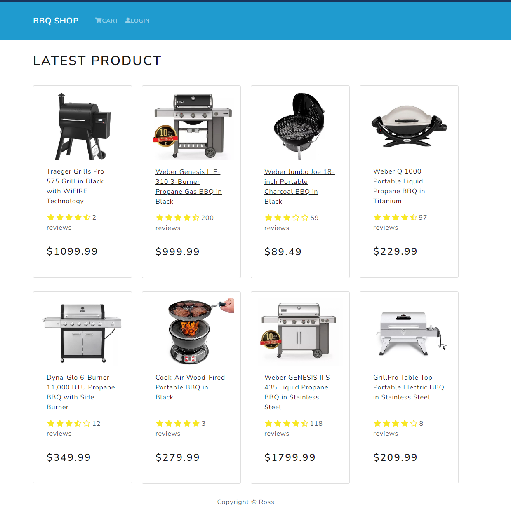

# Ecommerce Project

## Full Stack (REST API)

#### FrontEnd:

- **React**
  - Redux
  - Roputer (react-router-dom)
  - React Bootstrap

#### BackEnd:

- **Node.js & express (JavaScript)**

#### DataBase (NoSQL):

- **MongoDB**

<br />

**There is another project in my Github repo using the same frontend but using Python (Django) and PostGreSQL in backend**

<br />

## Link to live verison [here](https://www.onlineshopsample.ca/)

<br />



## How to run?

From both root and frontEnd folder:

```
npm install
```

- Create .env file with following information

```
NODE_ENV=development
PORT=5000
MONGO_URI=....
JWT_SECRET=....
```

- After intalling requrements and creating .env file, run following command on root to run both backend and frontend:

```
npm run dev
```

<br />
<br />

Contact Info:
| Name | Email |
|---------------|--------------------|
|Ross Ghazi |Ross.ghazi@gmail.com|
