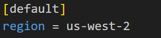
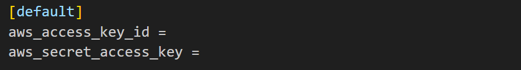
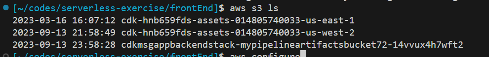
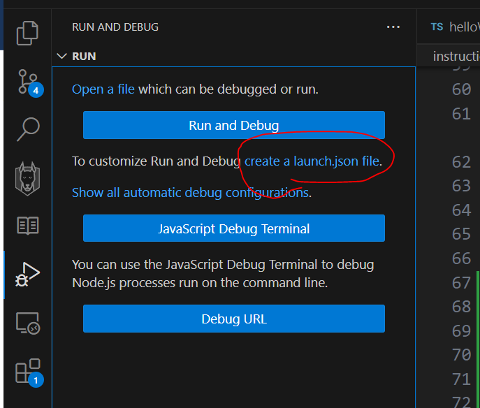

# Step by Step Instruction

## start cdk:

- Inside cdk folder: cdk init --language typescript

(run this command just when you want to start cdk project from beginning to create a boilerplate)

<br />

## set up AWS credential:

- type `aws configure`, put aws_access_key_id,aws_secret_access_key, us-west-2 and other stuff empty
  So you should have config and credentials files as below

- type `code ~/.aws/config` to see config file



- type `code ~/.aws/credentials` to see credentials file



- to ensure you are connected write: `aws s3 ls`



<br />

## install react

in frontend folder:

- yarn create react-app my-app --template typescript
- yarn start
- yarn build (to create build folder)

<br />
## backend

inside backend folder:

- npm init -y
- yarn add -D typescript ts-node nodemon jest ts-jest @types/node @types/jest uuid @types/uuid @types/aws-lambda
- yarn add -D esbuild (for bundling)
- **_important_** run yarn add -D esbuild for both cdk folder and backend folder

- yarn add --dev @tsconfig/node-lts (refer to https://github.com/tsconfig/bases)
- tsc --init (to create tsconfig.json file)
- delete content of tsconfig.json and only put:

```json
{
  "extends": "@tsconfig/node-lts/tsconfig.json"
}
```

- add these two script on package.json

```
 "build": "esbuild `find . \\( -name '**index.ts' \\) ! -path './node_modules/*'` --bundle --minify --sourcemap --platform=node --outdir=dist",

 "autobuild": "nodemon --ext ts --exec 'npm run build'"

```

<br />
## add debug

1. 

2. click on nodejs
3. copy paste what I have in my launch.json
4. fo to root folder:

- npm init -y
- yarn add -D typescript ts-node

5. create a test file and put bullet point. focus on th test file and run the test.

<br />
